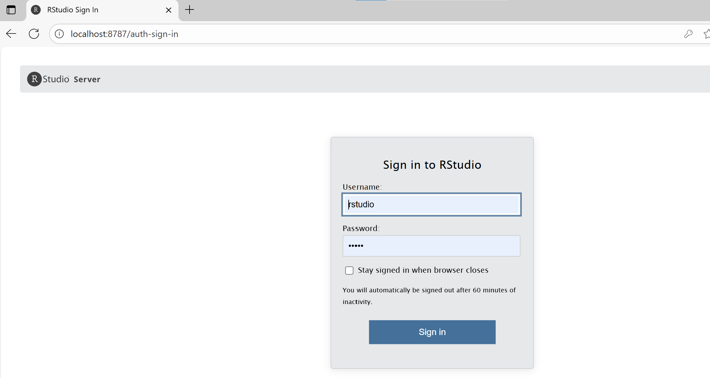
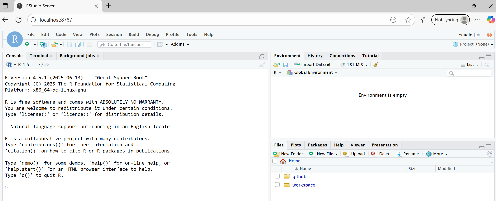

# rstudio-docker
My docker stack to use R Studio from the container

## How to use?

1. Create `.env` file
2. Make sure that Docker Desktop is running and build image with script `build.ps1`
3. Create shortcuts for `run-r-studio.bat` and `close-r-studio.bat` place them to Desktop
4. Launch R studio by 2x click on `run-r-studio.bat`
5. Login to R Studio and work ...
6. When finished working, close browser and 2x click on `close-r-studio.bat`

## Details

1. Windows Folder `{user}/Documents/GitHub` is already mapped and can be accessed from r-studio
2. Purpose of the script `close-r-studio.bat` is to stop and remove the container
3. Default browser will be opened once the container is running

## Why to use this?

- Don't need to install r, r-studio on your computer
- Simplifies update
- Advanced: allows user to save specific work for reproducible research (search my course on Udemy to learn more)

## Login page demo

Here’s what the app looks like running locally:

## r-studio demo

Here’s what the app looks like running locally:

